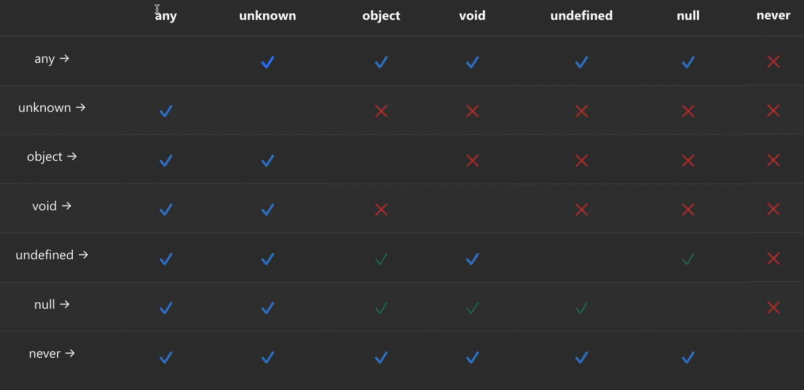

# Typescript 

## Destructuring 

```
- Rút gọn và làm cho code trở nên dễ đọc hơn.
- Trích xuất các giá trị cần thiết từ mảng hoặc đối tượng một cách nhanh chóng.
- Đặt tên cho các biến mới khác với tên thuộc tính trong đối tượng.
- Đặt giá trị mặc định cho các biến khi giá trị trong mảng hoặc đối tượng không tồn tại.
- Sử dụng trong các tham số của hàm để nhận các giá trị từ một đối tượng.
```

- Object destructuring.

- Array destructuring.

[Thực hành nèo ](ts/destructuring.ts) .

## Type Alias & Interface

- Type Alias:  ( định nghĩa bất kỳ kiểu dữ liệu nào ).
> Sử dụng từ khóa type và dấu = để định nghĩa kiểu dữ liệu.
> Có thể sử dụng union (|) hoặc intersection (&: Khi muốn gom 2 cái interface hay 2 cái object type or 1 object type 1 interface) để mở rộng type. 

- Interface: Đặt tên cho 1 Object Type.

> Sử dụng từ khóa extends để mở rộng interface.

```

- Có thể mở rộng : declaration merging - có thể định nghĩa lại và hệ thống sẽ tự merge vào nhau.
- Đặt tên : ComponentProps.

```

>> & = extends. 

[Thực hành nèo ](ts/OOP/interface.ts) .

### Nên dùng Type Alias hay Interface?

- Luôn dùng ```interface``` đến khi nào kh dùng dc nữa thì qua type alias.


<br></br>

## Enum

- Tập hợp 1 nhóm các kiểu dữ liệu cùng nhau.
- giúp chúng ta miêu tả 1 cách tường minh hơn.

```ts
enum Status {
    CREATED, // 0
    PROCESSING, //1
    FINISHED, //2
}
```

<details>
<summary>Enum và Constant</summary>


> Hạn chế dùng enum.

```ts
const PI = 3.14159;
const GRAVITY_ACCELERATION = 9.8;
const MAX_ARRAY_SIZE = 1000;

// Sử dụng Constant
let circumference = 2 * PI * radius;
let weight = mass * GRAVITY_ACCELERATION;
let myArray = new Array(MAX_ARRAY_SIZE);
```

```ts
enum EmployeeStatus {
  ACTIVE = 'ACTIVE',
  INACTIVE = 'INACTIVE',
  TERMINATED = 'TERMINATED',
  ON_LEAVE = 'ON_LEAVE'
}

// Sử dụng Enum
let employeeStatus: EmployeeStatus = EmployeeStatus.ACTIVE;
console.log(employeeStatus); // Output: 'ACTIVE'
```

</details>

## Generics


<br></br>

<details>
<summary>Function</summary>

1. Optional & default parameters.

- Optional : ```?``` .

```ts

function getLength(numberList?: number[]) {
    return Array.isArray(numberList) ? numberList.length : 0;
}

```

- Default parameters.

```ts

function getLength(numberList: number[] = []) {
    return Array.isArray(numberList) ? numberList.length : 0;
}

```

> Không thể kết hợp 2 cái.

2. Function Overload : (chồng hàm)Hàm có nhiều para khác nhau.
3. Void & never.

```ts
type Type = number & string; // never
```

```ts
function fail(msg: string): never {
    throw new Error(msg);
}
```

```ts
function fn(x: string | number) {
    if ( typeof x === "string") {
        //so something
    } else if (typeof x === "number") {
        //do something else
    } else {
        x; // has type 'never'
    }
}
```

3. Destructuring parameter.


```ts
function createStudent(id: number, name: string, age: number) {
    console.log(id,name, age)
}

createStudent(1, 'Hoa', 20)
```

- Gom lại thành 1 Object.

```ts
function createStudent(student: {id: number, name: string, age: number}) {
    const { id, name, age } = student;
    console.log(id,name, age)
}

createStudent({
    id: 1,
    name: 'Hoa',
    age: 20,
})
```

4. Type compatible.



</details>